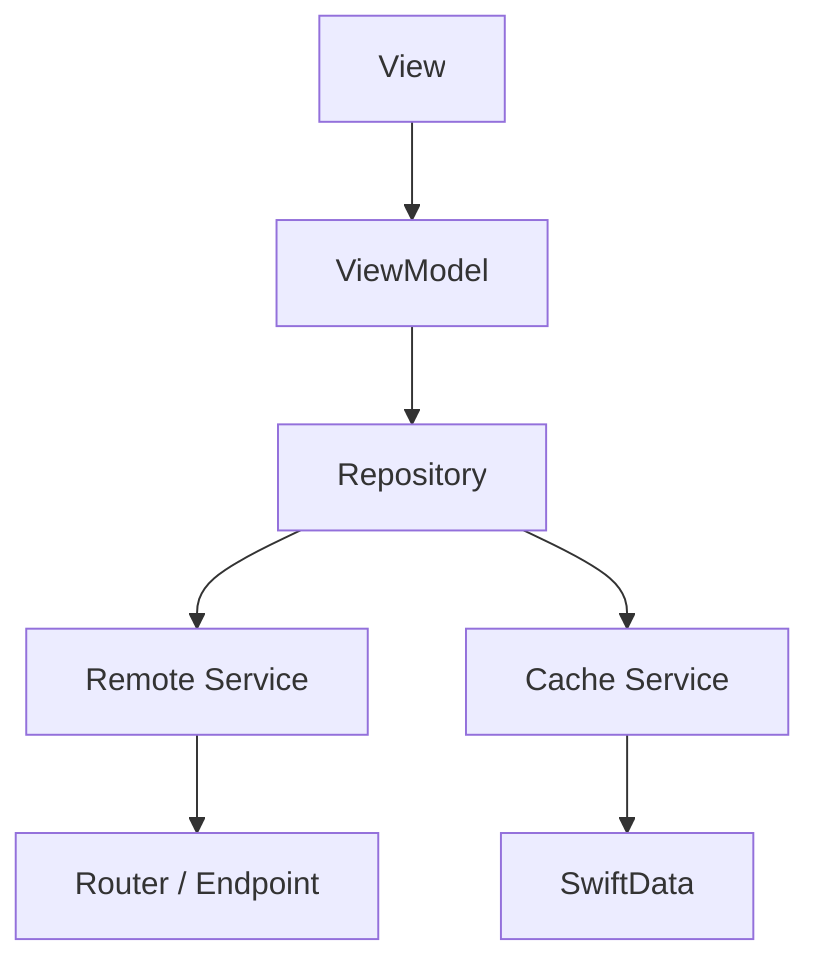
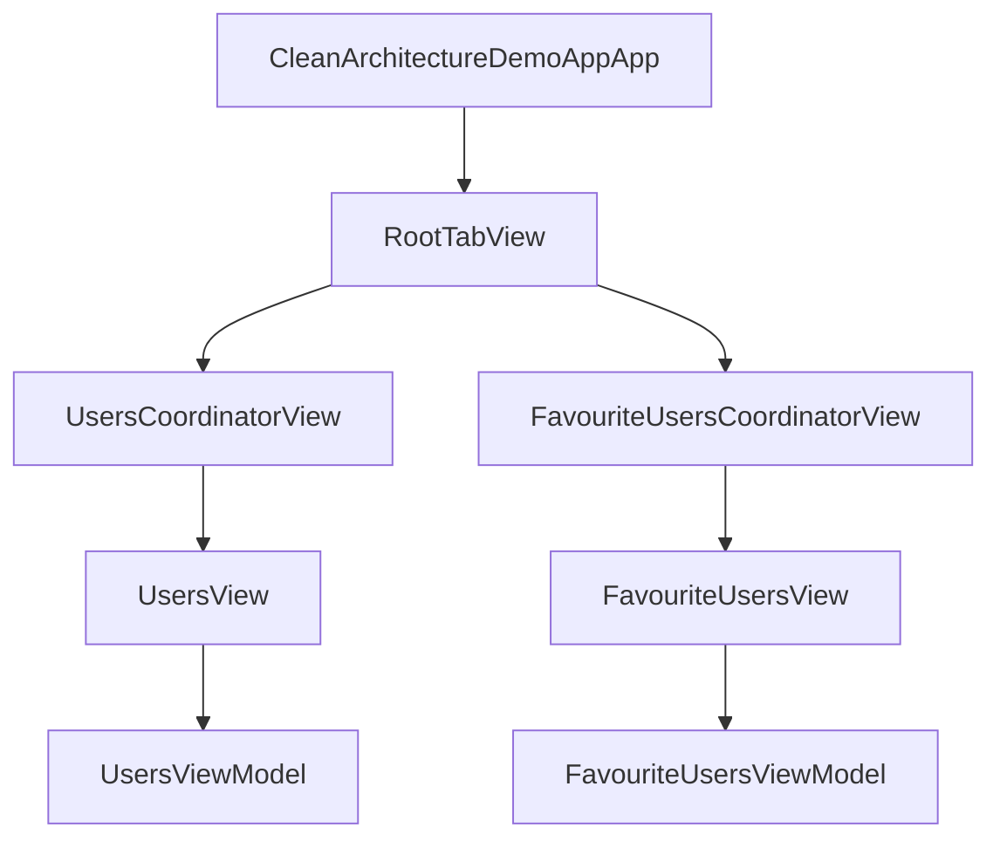

# SwiftUI Clean Architecture Demo

A production-style iOS demo app showcasing **MVVM-C**, **Repository pattern**, **offline-first architecture using SwiftData**, and **modular feature design**.

---

## Demo

### App Preview

> Add your recorded app GIF here

```md

```

Example:


---

## Screenshots

> Replace these with your real screenshots

```md
<p align="center">
  
  
  
</p>
```

<p align="center">
  
  
  
</p>

---

## Features

* Users list (remote + cached)
* Offline support (SwiftData fallback)
* Favourite users (local persistence)
* Tab-based navigation (MVVM-C)
* State-driven UI using ViewState
* Dependency Injection with a central container

---

## Architecture Diagram

### High-Level Flow



### App Navigation Flow



---

## Architecture Overview

The app follows a **layered architecture** to separate concerns and improve scalability.

```text
View
 ↓
ViewModel
 ↓
Repository
 ↓          ↓
Remote      Cache
(Service)   (SwiftData)
```

### Responsibilities

* **View** → Displays UI and forwards user actions
* **ViewModel** → Handles UI state and presentation logic
* **Repository** → Orchestrates data sources
* **Service** → Performs network requests
* **Cache Service** → Reads/writes local data via SwiftData

---

## Project Structure

```text
App
Core
 ├── Networking
 ├── Storage
 └── DesignSystem

Features
 ├── Users
 │   ├── View
 │   ├── ViewModel
 │   ├── Coordinator
 │   ├── Repository
 │   ├── Services
 │   └── Cache
 │
 └── FavUsers
     ├── View
     ├── ViewModel
     ├── Coordinator
     ├── Repository
     └── Cache

Models
Utilities
Resources
```

---

## Data Flow

1. The user interacts with the **View**
2. The View forwards the action to the **ViewModel**
3. The ViewModel asks the **Repository** for data
4. The Repository decides whether to:

   * fetch from the network
   * or return cached local data
5. API DTOs are mapped into **Domain Models**
6. The View reacts to changes through **ViewState**

---

## Networking Layer

The networking layer uses a **Router + Endpoint abstraction**.

### Highlights

* Generic request flow
* Endpoint-based API definitions
* Parameter encoding
* Header injection
* Auth-ready design through `requiresAuth`

### Example Flow

```text
ViewModel → Repository → Router → Endpoint → API
```

---

## Offline Strategy

The app uses an **offline-first approach**:

* Remote data is fetched through `UsersService`
* Data is cached locally via SwiftData
* If the network request fails, the repository falls back to cached data

```text
Online  → fetch → cache → display
Offline → fail  → load cache → display
```

This keeps the app functional even without internet connectivity.

---

## Favourites Feature

The favourites flow is intentionally local-first.

### Behaviour

* A user can be marked as favourite from the Users list
* Favourites are persisted in SwiftData
* Favourite users are shown in a dedicated tab
* This demonstrates feature-to-feature interaction while keeping layers isolated

---

## ViewState Pattern

UI state is driven using a generic `ViewState`.

```swift
enum ViewState<T> {
    case idle
    case loading
    case success(T)
    case failure(String)
}
```

### Why this helps

* predictable rendering
* clear loading/error handling
* easier unit testing
* simpler state management in SwiftUI

---

## Dependency Injection

A `DependencyContainer` is used to construct:

* network services
* cache services
* repositories
* view models

### Benefits

* loose coupling
* easier mocking
* better testability
* clearer ownership of dependencies

---

## Testing Strategy

The architecture is designed to be testable through:

* protocol-based abstractions
* mock services
* repository injection
* isolated ViewModel logic

### Example test candidates

* `UsersRepositoryTests`
* `UsersViewModelTests`
* `FavouriteUsersRepositoryTests`

---

## Why This Architecture?

This architecture was chosen to:

* scale features independently
* support offline-first behaviour
* keep business logic out of views
* improve long-term maintainability
* make the app easier to test and evolve

---

## Summary

This project demonstrates:

* Clean Architecture principles
* MVVM-C navigation
* Repository + Service pattern
* Offline-first data handling
* SwiftData integration
* Modular feature design
* Local persistence for favourites

---

## Getting Started

### Requirements

* Xcode 16+
* iOS 18+
* Swift 6+

### Run

1. Clone the repository
2. Open the project in Xcode
3. Build and run on Simulator or device

---

## Author

**Akib Quraishi**
iOS Developer — Swift, SwiftUI, Clean Architecture

Portfolio: `www.akibmakesapps.co.uk`

---

## Notes

This project is intended as an architecture-focused demo for portfolio and interview review.
The emphasis is on **structure, scalability, and engineering practices** rather than feature completeness.

