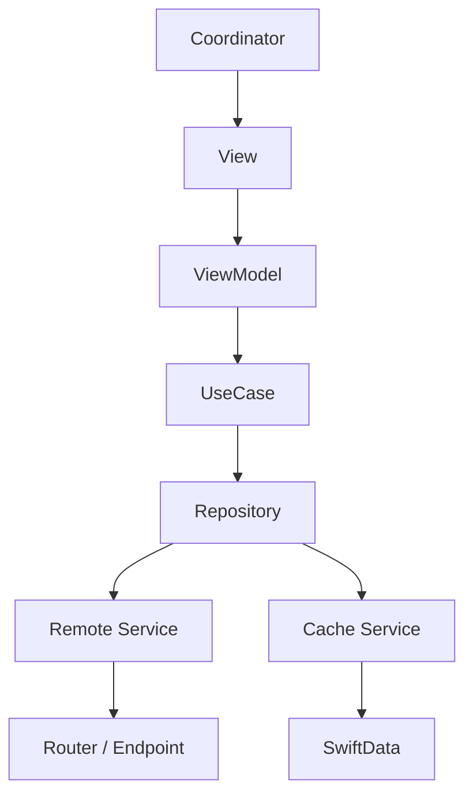
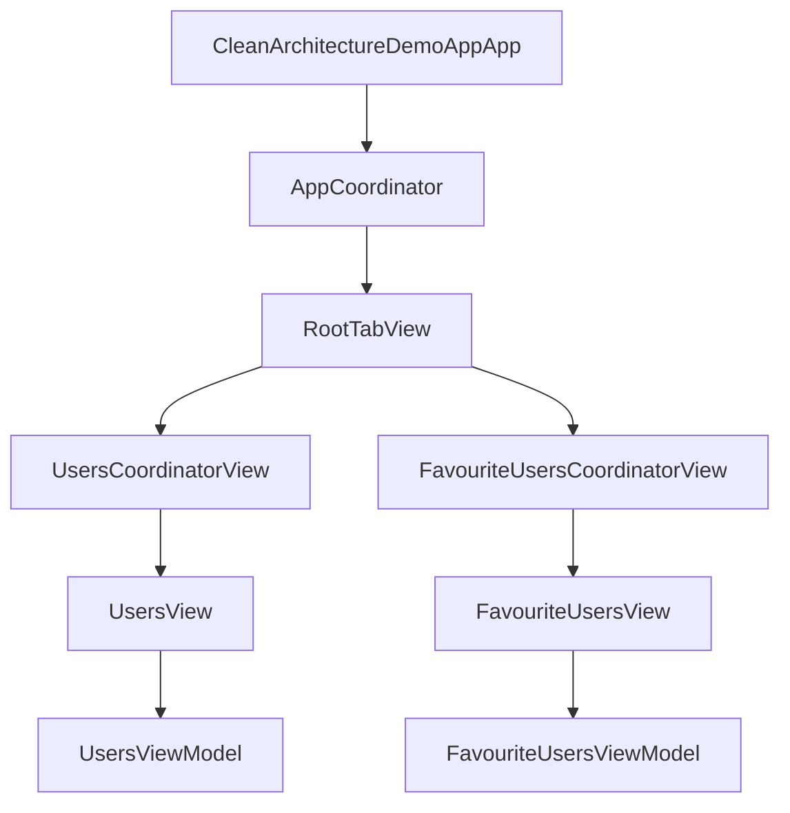

# SwiftUI Clean Architecture Demo

A production-style iOS demo application showcasing **Clean Architecture**, **MVVM-C**, **Use Cases**, **Repository Pattern**, **SwiftData**, and **offline-first design**.

The goal of this project is to demonstrate scalable architecture, separation of concerns, testability, and modern SwiftUI development practices.

---

# 🚀 Features

- Users list from remote API
- Offline-first architecture
- SwiftData local persistence
- Favourite users management
- MVVM-C navigation
- Clean Architecture
- Use Case pattern
- Repository pattern
- Dependency Injection
- State-driven UI using ViewState
- Modular feature organisation

---

# 🏗 Architecture

## Clean Architecture Flow


```mermaid
flowchart TD
    A[Coordinator] --> B[View]
    B --> C[ViewModel]
    C --> D[UseCase]
    D --> E[Repository]
    E --> F[Remote Service]
    E --> G[Cache Service]
    F --> H[Router / Endpoint]
    G --> I[SwiftData]
```

## Navigation Flow


```mermaid
flowchart TD
    A[CleanArchitectureDemoAppApp] --> B[AppCoordinator]
    B --> C[RootTabView]

    C --> D[UsersCoordinatorView]
    C --> E[FavouriteUsersCoordinatorView]

    D --> F[UsersView]
    F --> G[UsersViewModel]

    E --> H[FavouriteUsersView]
    H --> I[FavouriteUsersViewModel]
```

---

# 📐 Architecture Overview

The application follows a Clean Architecture inspired approach combined with MVVM-C.

```text
Coordinator
    ↓
View
    ↓
ViewModel
    ↓
UseCase
    ↓
Repository
   ↙        ↘
Service    Cache
(API)      (SwiftData)
```

This structure provides:

- Separation of concerns
- Testability
- Scalability
- Reusability
- Clear ownership of responsibilities

---

# 🧩 Layer Responsibilities

## Coordinator

Responsible for:

- Navigation
- Flow orchestration
- Screen composition
- Dependency injection entry points

Examples:

- AppCoordinator
- UsersCoordinatorView
- FavouriteUsersCoordinatorView

The coordinator layer owns navigation and screen creation while keeping navigation logic out of views.

---

## View

Responsible for:

- Rendering UI
- Handling user interactions
- Observing ViewModel state

Views contain no business logic.

Examples:

- UsersView
- UserListView
- FavouriteUsersView

---

## ViewModel

Responsible for:

- Presentation logic
- UI state management
- Executing use cases
- Transforming data into display-ready state

ViewModels do not communicate directly with services or storage.

Examples:

- UsersViewModel
- FavouriteUsersViewModel

---

## Use Cases

Use Cases represent business actions and application capabilities.

Examples:

- GetUsersUseCase
- GetFavouriteUsersUseCase
- AddFavouriteUserUseCase
- RemoveFavouriteUserUseCase

Benefits:

- Isolated business logic
- Easy unit testing
- Reusable business operations
- Clear intent

---

## Repository

Repositories orchestrate data sources.

Responsibilities:

- Fetch data from APIs
- Read local cache
- Handle fallback strategies
- Hide implementation details

Examples:

- UsersRepository
- FavouriteUsersRepository

Repositories act as the single source of truth for ViewModels and Use Cases.

---

## Services

Services handle implementation details.

### Remote Services

Examples:

- UsersService

Responsibilities:

- API communication
- Request construction
- Response decoding

### Local Services

Examples:

- UsersCacheService
- FavouriteUsersCacheService

Responsibilities:

- SwiftData operations
- Local persistence
- Cache retrieval

---

## Storage

SwiftData is used for local persistence.

Stored entities:

- CachedUser
- FavouriteUser

The storage layer remains hidden behind cache services and repositories.

---

# 📂 Project Structure

```text
App
├── AppCoordinator
├── DependencyContainer
├── RootTabView

Core
├── Networking
├── Storage
└── DesignSystem

Features
├── Users
│   ├── Coordinator
│   ├── View
│   ├── ViewModel
│   ├── UseCases
│   ├── Repository
│   ├── Services
│   └── Cache
│
└── FavUsers
    ├── Coordinator
    ├── View
    ├── ViewModel
    ├── UseCases
    ├── Repository
    └── Cache

Models
Resources
Utilities
```

---

# 🔗 Dependency Injection

A central `DependencyContainer` is responsible for constructing:

- Services
- Cache Services
- Repositories
- Use Cases
- ViewModels

Benefits:

- Loose coupling
- Easier testing
- Mock-friendly architecture
- Explicit dependencies
- Improved maintainability

---

# 🔄 Data Flow

## Loading Users

```text
UsersView
    ↓
UsersViewModel
    ↓
GetUsersUseCase
    ↓
UsersRepository
   ↙           ↘
API         SwiftData Cache
```

## Adding a Favourite

```text
UsersView
    ↓
UsersViewModel
    ↓
AddFavouriteUserUseCase
    ↓
FavouriteUsersRepository
    ↓
FavouriteUsersCacheService
    ↓
SwiftData
```

---

# 🌐 Networking Layer

The networking layer uses a Router + Endpoint abstraction.

### Features

- Generic request execution
- Endpoint-based API definitions
- Request parameter encoding
- Header injection
- Auth-ready architecture
- Async/Await support

### Flow

```text
ViewModel
    ↓
UseCase
    ↓
Repository
    ↓
Router
    ↓
Endpoint
    ↓
API
```

---

# 💾 Offline Strategy

The application follows an offline-first approach.

### Online

```text
API
 ↓
Repository
 ↓
SwiftData Cache
 ↓
UI
```

### Offline

```text
API Request Fails
 ↓
Repository
 ↓
SwiftData Cache
 ↓
UI
```

This ensures the application remains functional without internet connectivity.

---

# ❤️ Favourites Feature

The favourites flow is intentionally local-first.

### Features

- Mark users as favourite
- Persist favourites locally
- Dedicated favourites tab
- Real-time UI updates
- SwiftData-backed storage

This demonstrates feature-to-feature communication while preserving architectural boundaries.

---

# 🎭 ViewState Pattern

UI state is managed using a generic ViewState.

```swift
enum ViewState<T> {
    case idle
    case loading
    case success(T)
    case failure(String)
}
```

### Benefits

- Predictable rendering
- Explicit loading states
- Consistent error handling
- Simpler SwiftUI updates
- Easier testing

---

# 🧪 Testing Strategy

The architecture is designed for unit testing through:

- Protocol-based abstractions
- Mock services
- Mock repositories
- Dependency injection
- Isolated business logic

Example test targets:

- UsersRepositoryTests
- UsersViewModelTests
- GetUsersUseCaseTests
- FavouriteUsersRepositoryTests

---

## Test Coverage

The project includes unit tests covering:

- ViewModels
- Use Cases
- Repositories

Coverage focuses on business logic and data orchestration layers rather than UI rendering.


# 🤔 Why This Architecture?

This architecture was chosen to:

- Scale features independently
- Support offline-first behaviour
- Improve maintainability
- Improve testability
- Isolate business rules
- Reduce coupling
- Encourage reusable components

---

# 📋 Summary

This project demonstrates:

- Clean Architecture
- MVVM-C Navigation
- Use Case Pattern
- Repository Pattern
- Dependency Injection
- Offline-first Architecture
- SwiftData Persistence
- Feature Modularisation
- Local Favourites Management
- State-driven UI
- Testable Architecture
- Modern Swift Concurrency

---

# 🛠 Getting Started

## Requirements

- Xcode 16+
- iOS 18+
- Swift 6+

## Run

1. Clone the repository
2. Open the project in Xcode
3. Build and run on Simulator or Device

---

# 👨‍💻 Author

**Akib Quraishi**

Senior iOS Developer

Technologies:

- Swift
- SwiftUI
- UIKit
- Combine
- SwiftData
- Clean Architecture
- MVVM-C

---

# 📝 Notes

This project is intentionally focused on architecture and engineering practices rather than feature completeness.

The primary objective is to demonstrate production-style iOS application architecture, maintainability, testability, and scalability.
